# Ashes Renderer

[English](README.md) | [简体中文](README.zh-CN.md)

Ashes Renderer is a real-time CPU software rasterizer written in **C++17**, focused on implementing a complete modern rendering pipeline in a CPU-only environment.

It supports PBR / IBL, directional-light shadows, skeletal animation, multiple anti-aliasing modes, and transparent rendering. CPU rendering performance is improved through per-triangle parallel rasterization, multi-level culling, Early-Z, and Reversed-Z. The project provides native window implementations for Windows, macOS, and Linux. The renderer core depends only on two header-only third-party libraries: `nlohmann/json` and `stb_image`.

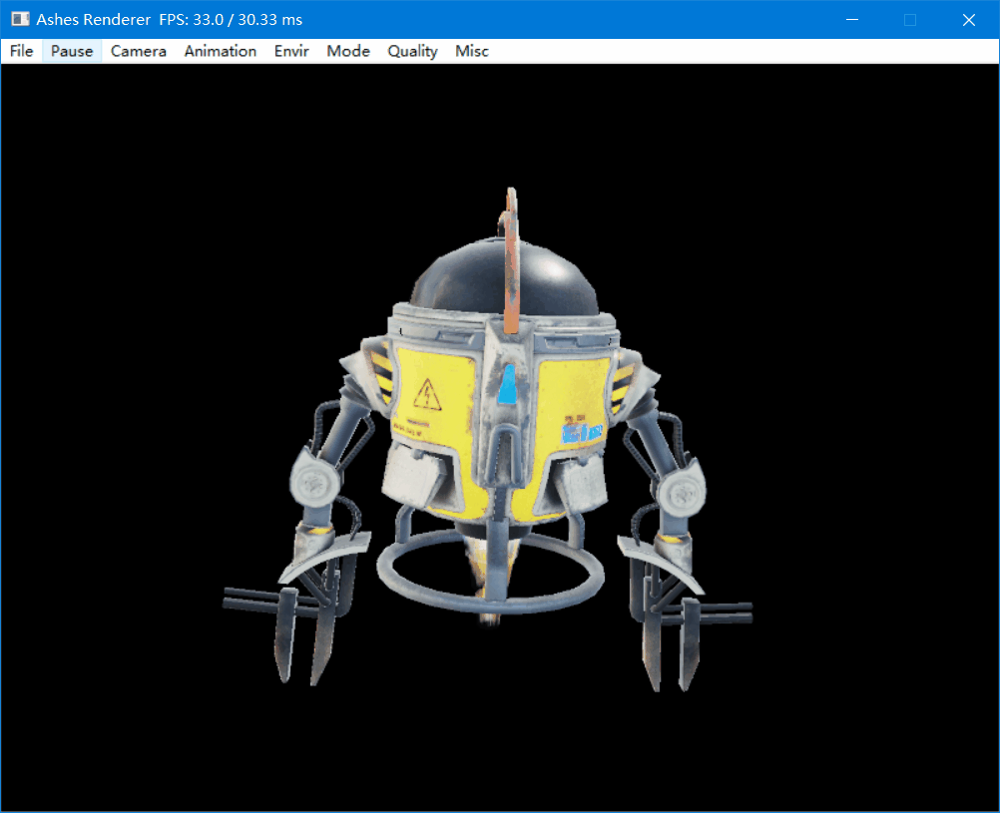

## Table of Contents

- [Feature Overview](#feature-overview)
- [Rendering Pipeline](#rendering-pipeline)
  - [Stage Responsibilities](#stage-responsibilities)
  - [Geometry Processing and Rasterization](#geometry-processing-and-rasterization)
  - [Materials and Lighting](#materials-and-lighting)
  - [Anti-Aliasing, Transparency, and Color](#anti-aliasing-transparency-and-color)
  - [Performance Design](#performance-design)
- [Asset Import and Animation](#asset-import-and-animation)
- [Runtime Interaction](#runtime-interaction)
- [Build, Run, and Cross-Platform Support](#build-run-and-cross-platform-support)
- [IBL Environment Precomputation](#ibl-environment-precomputation)
- [Third-Party Dependencies](#third-party-dependencies)
- [Project Structure](#project-structure)
- [License](#license)

## Feature Overview

- **CPU rendering pipeline**: Depth Pre-pass, Shadow Pass, and Base / Transparent Shading Pass are executed as separate stages. The geometry stage performs homogeneous-space clipping, while the rasterization stage generates fragments with scanline traversal and perspective-correct interpolation. Depth is handled with Reversed-Z.
- **Materials and lighting**: Supports Blinn-Phong, PBR Metallic-Roughness, and PBR Specular-Glossiness. PBR materials support IBL from HDR environment maps. Real-time lights include ambient, directional, and point lights, with real-time directional-light shadows that can use either hard shadows or PCF filtering.
- **Anti-aliasing, transparency, and color**: Supports MSAA, SSAA, ECSAA, Alpha Blending, and fixed 4-layer OIT. Post-processing includes auto exposure, ACES Filmic Tone Mapping, and gamma correction.
- **Performance design**: Uses a custom `ThreadPool` and segmented `SpinLock` to rasterize triangles in parallel. Frustum / bounding-box culling, back-face culling, homogeneous-space clipping, early depth tests, render-order optimization, and low-level hot-path optimizations reduce unnecessary work.
- **Math foundation**: Includes custom `Vector`, `Matrix`, `Quaternion`, and `TransformationSRT` implementations for geometry transforms, cameras and projections, clipping and culling, skeletal skinning, and animation interpolation.
- **Asset import and animation**: Supports glTF 2.0, OBJ / MTL, and `.ashes` scene configuration files. glTF import covers meshes, materials, textures, cameras, node hierarchies, Punctual Lights, skeletal skinning, keyframe animation, and both PBR material workflows.
- **Cross-platform engineering**: Provides native window implementations for Windows, macOS, and Linux, with native menus for runtime configuration. Platform project files and build entry points are included, while the renderer core depends only on `nlohmann/json` and `stb_image`.

## Rendering Pipeline

Each frame is executed in the following stages:

```text
Scene update and animation
  -> Draw call collection and frustum culling
  -> Depth Pre-pass
  -> Shadow Pass
  -> Base / Transparent Shading Pass
  -> Screen Pass
  -> Native window presentation
```

### Stage Responsibilities

- **Depth Pre-pass**: Opaque objects write depth before the full shading stage, reducing material evaluation for occluded fragments.
- **Shadow Pass**: Generates shadow maps for shadow-casting lights, which are sampled by later shading stages.
- **Base / Transparent Shading Pass**: Opaque objects are rendered first, followed by transparent objects. Transparent objects are sorted from far to near in view depth to preserve correct Alpha Blending composition.
- **Screen Pass**: Performs ECSAA / OIT composition, MSAA / SSAA downsampling, auto exposure, ACES Filmic Tone Mapping, gamma correction, and background fill.

### Geometry Processing and Rasterization

- **Homogeneous-space clipping**: Clips polygons against all six frustum planes before perspective division, correctly handling triangles that cross the near plane or screen boundaries.
- **Reversed-Z depth**: Maps the near plane to `1.0` and the far plane to `0.0`, improving depth precision at long distances.
- **Scanline rasterization**: Finds triangle edge intersections for each scanline and emits pixel spans row by row.
- **Barycentric coordinates and perspective-correct interpolation**: Adjusts screen-space barycentric weights using reciprocal depth, then interpolates texture coordinates, normals, and world-space attributes without perspective distortion.
- **Texture gradients**: Computes texture-coordinate derivatives from the ratio between screen-space and texture-space differential areas, providing the input for Mipmap LOD selection.

### Materials and Lighting

The renderer includes three material workflows:

- **Blinn-Phong**: Supports ambient, diffuse, specular, and normal maps, mainly for OBJ / MTL assets.
- **PBR Metallic-Roughness**: Supports Base Color, Metallic, Roughness, Normal, Occlusion, and Emissive channels.
- **PBR Specular-Glossiness**: Supports Albedo, Specular, Glossiness, Normal, Occlusion, and Emissive channels.

IBL uses precomputed **irradiance cubemaps, prefilter cubemaps, and a BRDF LUT** to provide diffuse environment lighting and roughness-dependent specular reflections for PBR materials. Real-time lights include ambient, directional, and point lights. Shadows currently support directional lights only, with hard shadows or PCF filtering and adjustable shadow-map resolution.

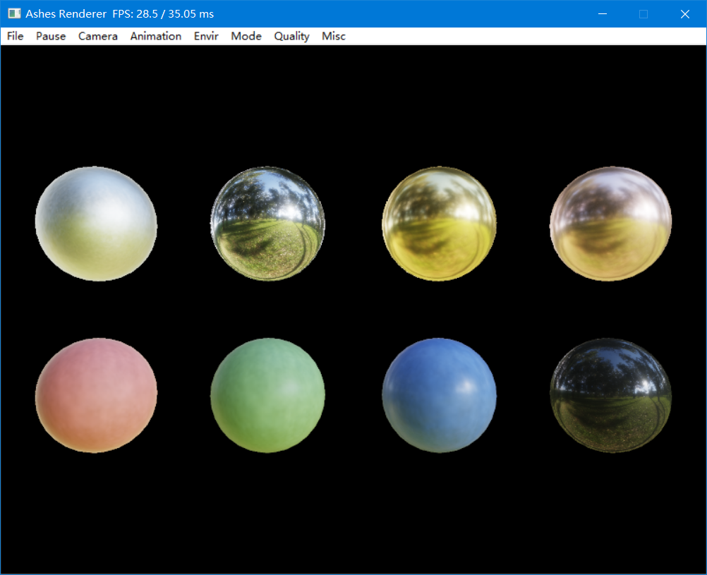

### Anti-Aliasing, Transparency, and Color

- **MSAA / SSAA**: Improve edge quality through multisampling and 2x supersampling respectively. They are mutually exclusive and cannot be enabled at the same time.
- **ECSAA**: A custom low-cost triangle-edge anti-aliasing method. It estimates coverage at fragment boundaries and blends colors. It can be enabled independently or combined with MSAA or SSAA.
- **Transparent rendering**: Supports regular Alpha Blending and depth-sorted OIT composition. OIT stores up to **4 layers** of transparent samples per pixel with fixed capacity and no linked lists. Extra layers are discarded, making it suitable for light to moderate transparent overlap.
- **Color processing**: Supports average-luminance auto exposure, ACES Filmic Tone Mapping, and gamma correction.

Anti-aliasing comparison:

<table>
  <tr>
    <th width="50%">No Anti-Aliasing</th>
    <th width="50%">ECSAA</th>
  </tr>
  <tr>
    <td width="50%">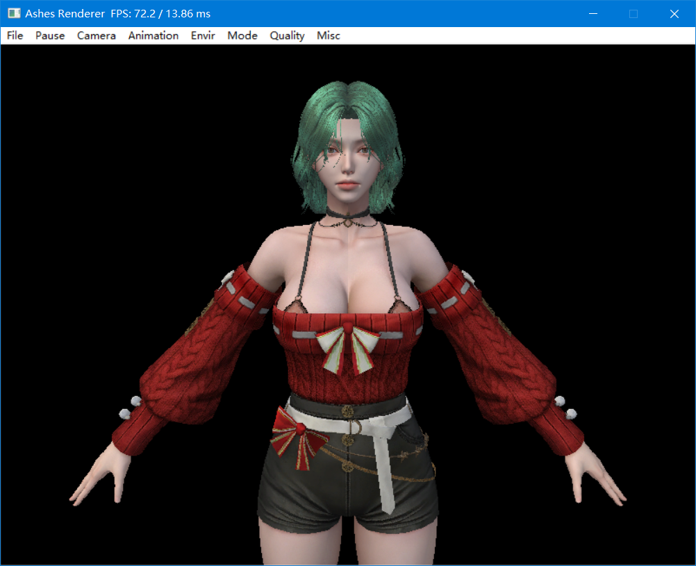</td>
    <td width="50%">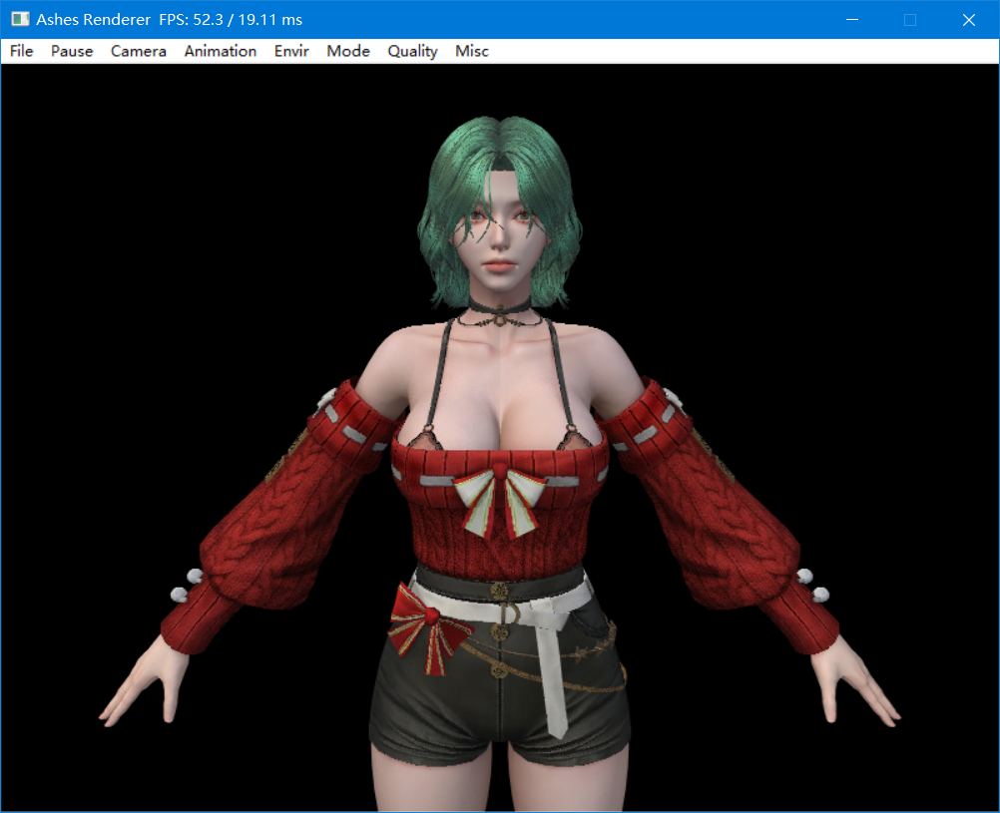</td>
  </tr>
  <tr>
    <th width="50%">MSAA</th>
    <th width="50%">SSAA</th>
  </tr>
  <tr>
    <td width="50%">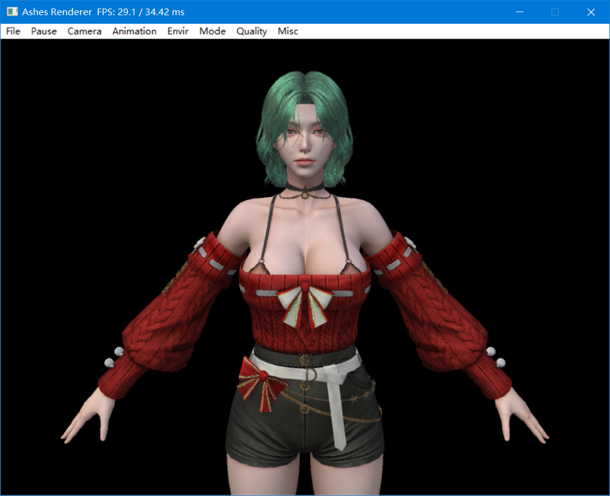</td>
    <td width="50%"></td>
  </tr>
</table>

OIT transparent rendering comparison:

<table>
  <tr>
    <th width="50%">Alpha Blending</th>
    <th width="50%">OIT</th>
  </tr>
  <tr>
    <td width="50%">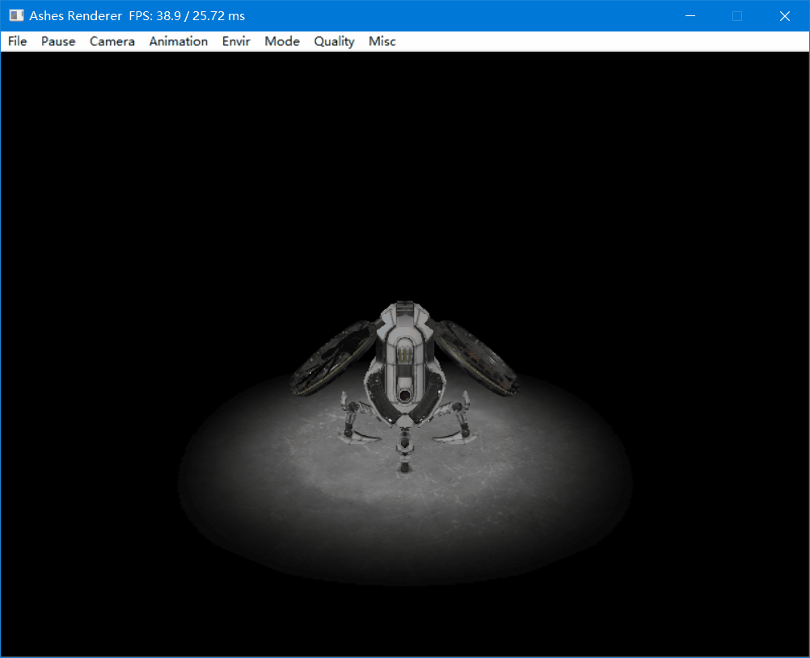</td>
    <td width="50%">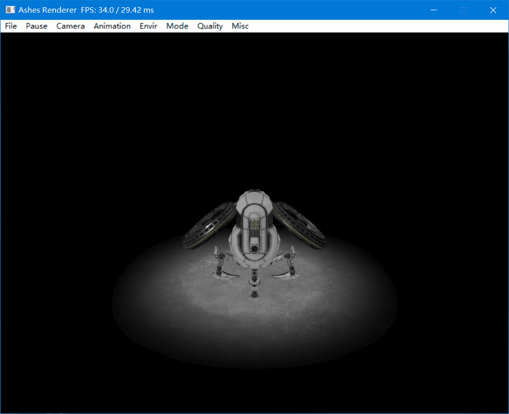</td>
  </tr>
</table>

Texture filtering comparison:

<table>
  <tr>
    <th width="50%">No Texture Filtering</th>
    <th width="50%">LinearMipPoint</th>
  </tr>
  <tr>
    <td width="50%"></td>
    <td width="50%">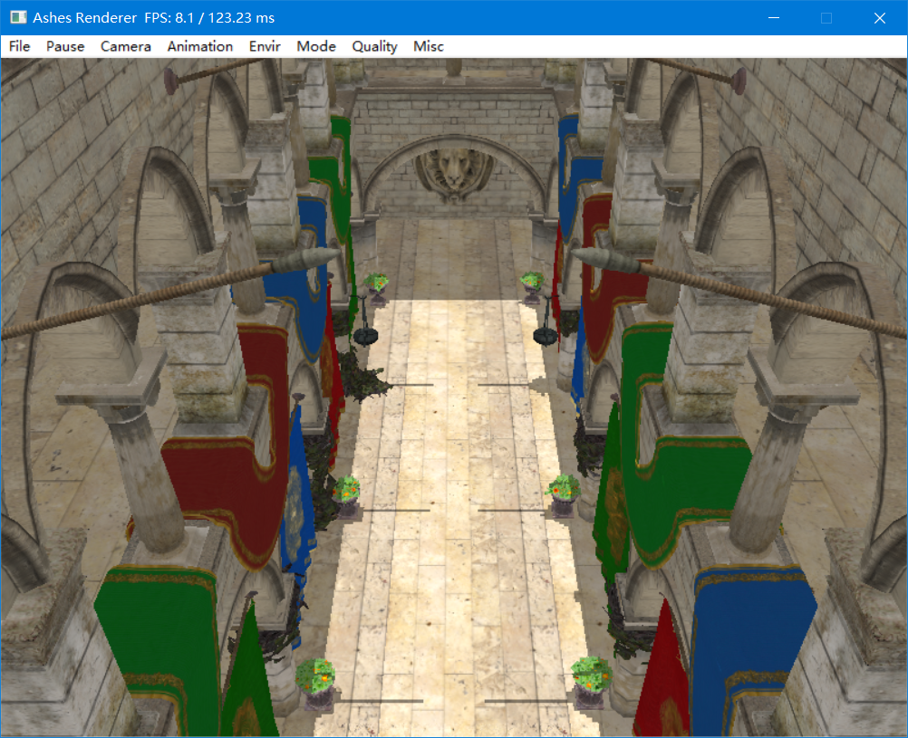</td>
  </tr>
</table>

### Performance Design

Ashes Renderer combines culling and parallelism at multiple granularities to achieve high throughput in a pure CPU environment:

- **Multi-level culling**: Draw-call-level frustum / bounding-box culling -> triangle-level back-face culling and homogeneous-space clipping -> pixel-batch-level early rejection using the triangle's nearest depth value against the existing framebuffer depth, skipping barycentric interpolation and shading for batches that fail.
- **Render-order optimization**: Opaque objects are rendered from near to far in view depth to optimize depth-buffer construction during the Depth Pre-pass. The later Base Shading Pass then uses that depth buffer to reduce shading for occluded fragments. Transparent objects are rendered from far to near to preserve correct Alpha Blending composition.
- **Hot-path optimization**: Math and texture-sampling paths minimize runtime cost through `FastLog2` / `FastPow2` approximations, precomputed fractional texture LOD tables, global static lookup data, templated texture-filter dispatch, extensive `constexpr` evaluation, and templated vector, matrix, and interpolation utilities.
- **Fine-grained parallelism**: Draw calls and triangles are dynamically claimed by worker threads using atomic counters, so multiple threads can process different triangles from the same draw call concurrently. The framebuffer uses segmented `SpinLock` instances instead of a global mutex, limiting write contention to small regions.

## Asset Import and Animation

### glTF 2.0

Supports meshes, materials, textures, cameras, node hierarchies, Punctual Lights, skeletal skinning, and keyframe animation, covering both Metallic-Roughness and Specular-Glossiness PBR workflows.

### OBJ / MTL

Supports static meshes and MTL materials, useful for quickly inspecting traditional model assets.

### `.ashes` Scene Configuration

When loading a glTF or OBJ file, the renderer looks for a `.ashes` file with the same base name. This file can add cameras and lights and preset common runtime render settings.

## Runtime Interaction

The native menu allows settings to be changed without recompiling or restarting the program:

- **File / Pause**: Open or switch models, pause the render loop, and quit the program.
- **Camera / Animation / Envir**: Switch cameras, animations / movies, and IBL environments.
- **Mode**: Inspect final color, depth, normals, and material-channel debug views.
- **Quality**: Adjust texture filtering, shadow quality, and anti-aliasing mode.
- **Misc**: Adjust render thread count, background color, ground plane, back-face culling, OIT, ACES, and gamma correction.

Drag with the left mouse button to rotate the view, drag with the right mouse button to pan, and use the mouse wheel to zoom in or out. The window title displays real-time FPS and frame time.

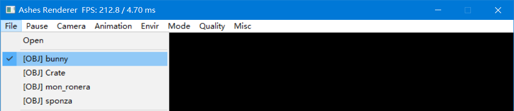

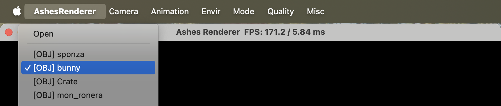

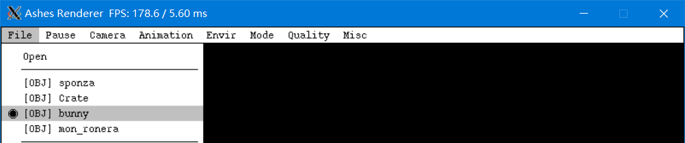

## Build, Run, and Cross-Platform Support

The project requires a compiler and standard library with full **C++17** support. Debug and Release configurations are provided for each platform.

| Platform | Project file / build entry point | Toolchain requirements |
|------|----------------------|------------|
| Windows | [Build/Windows/AshesRenderer.sln](Build/Windows/AshesRenderer.sln) | Visual Studio 2019 or later, MSVC v142 toolset, Windows 10 SDK. |
| macOS | [Build/Mac/AshesRenderer.xcodeproj](Build/Mac/AshesRenderer.xcodeproj) | Xcode 16.2 or later, Apple Clang, C++17, macOS 15.2 SDK; the window layer depends on AppKit. |
| Linux | [Build/Linux/Makefile](Build/Linux/Makefile), or open the project with [Build/Linux/AshesRenderer.code-workspace](Build/Linux/AshesRenderer.code-workspace) | GCC 11 or later, `make`, and X11 runtime and development libraries (linked with `libX11`). |

The program loads this asset by default:

```text
Resources/Models/gltf/pbr_material_reference/scene.gltf
```

Other `.gltf` or `.obj` files can also be loaded through the runtime **File > Open** menu.

## IBL Environment Precomputation

[Tools/IBLCubemapConverter](Tools/IBLCubemapConverter) provides a Python tool for converting HDR panoramas into the irradiance cubemaps, prefilter cubemaps, and BRDF LUT used by the renderer. Install dependencies with:

```bash
python -m pip install -r Tools/IBLCubemapConverter/requirements.txt
```

The tool entry point and argument definitions are in [Tools/IBLCubemapConverter/main.py](Tools/IBLCubemapConverter/main.py). Generated results can be placed under `Resources/Envirs/<environment-name>/` and then selected from the **Envir** menu.

## Third-Party Dependencies

The renderer core only depends on the C++ standard library. The following third-party libraries are embedded in [Source/ThirdParty](Source/ThirdParty):

| Library | Purpose | License |
| --- | --- | --- |
| [nlohmann/json](https://github.com/nlohmann/json) (`json.hpp`, v3.10.4) | Parses glTF and `.ashes` scene configuration files | MIT |
| [stb_image](https://github.com/nothings/stb) (`stb_image.h`, v2.27) | Loads PNG / JPG / HDR textures and environment maps | Public Domain / MIT |

Python dependency versions for [Tools/IBLCubemapConverter](Tools/IBLCubemapConverter) are listed in its [requirements.txt](Tools/IBLCubemapConverter/requirements.txt).

## Project Structure

```text
Source/
|-- Asset/       # Meshes, materials, textures, cameras, lights, skeletons, and animation
|-- Geometry/    # Bounding boxes, frustums, clipping, and triangle geometry
|-- Math/        # Vectors, matrices, quaternions, and transforms
|-- Parser/      # glTF, OBJ, MTL, and .ashes parsing
|-- Platform/    # Native window layers for Windows / macOS / Linux
|-- Rasterize/   # Renderer, framebuffer, shader, scene, and app entry point
`-- Utility/     # Thread pool, locks, and utility helpers

Resources/       # Example models and HDR / IBL environments
Test/            # Math module unit tests
Tools/           # Offline asset processing tools
Build/           # Platform project files
```

## License

This project is released under the [MIT License](LICENSE).
